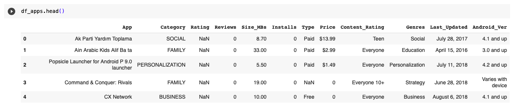
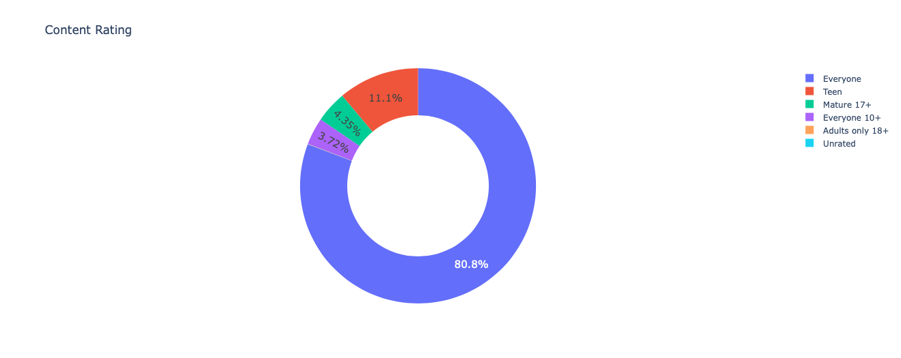
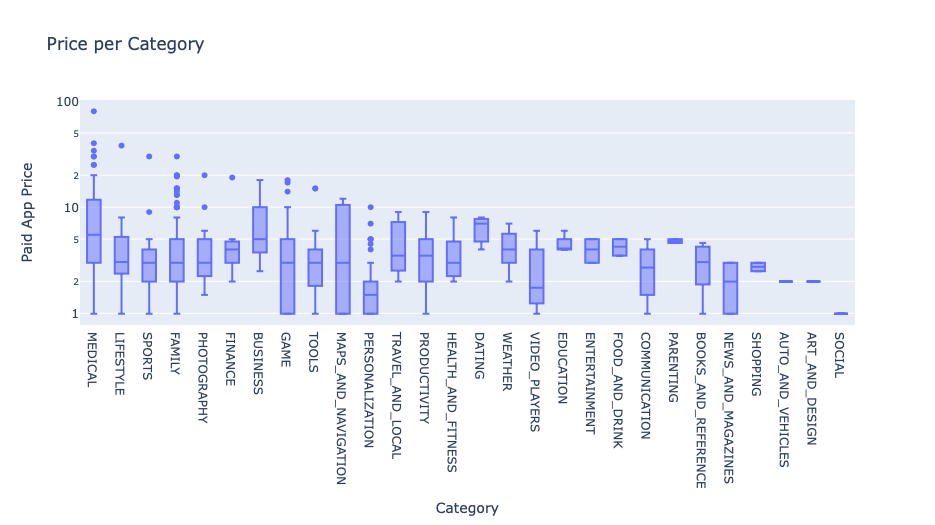

## Introduction and Objective: 

We all have once thought about building your own App. Here, we will do a comprehensive analysis of the Android app market by comparing thousands of apps in the Google Play store.
we will compare thousands of apps in the Google Play Store so that we can gain insight into:

- How competitive different app categories (e.g., Games, Lifestyle, Weather) are
- Which app category offers compelling opportunities based on its popularity
- How many downloads you would give up by making your app paid vs. free
- How much you can reasonably charge for a paid app
- Which paid apps have had the highest revenue
- How many paid apps will recoup their development costs based on their sales revenue

## About the Dataset of Google Play Store Apps & Reviews
App and review data was scraped from the Google Play Store by Lavanya Gupta in 2018. Original files listed [here](
https://www.kaggle.com/lava18/google-play-store-apps).
The dataset contains following columns:  
|App |Category|Rating|Reviews|Size_MBs|Installs|Type|Price|Content_Rating|Genres|Last_Updated|Android_Ver|
|---|---|---|---|---|---|---|---|---|---|---|---|  

## Analysis summary:
We will use Pandas, NumPym and Plotly to analyse and get insights from the datasset. **Please check the .ipynb file for detailed explanation**.
 - Read the Dataset
  
  
- Cleaning (NaN and Duplicates)
- Highest Rated Apps, Largest Apps in terms of Size (MBs), Top Apps with Most Reviews

### Analysing App Categories
- Visualise Categorical Data: Content Ratings
  
  
  
- Highest Competition (Number of Apps)
  
  
  
- Most Popular Categories (Highest Downloads)

  

- Category Concentration: Competition (Number of Apps) vs Popularity (Number of Downloads)

  

- Competition in Genres

  

- Free vs. Paid Apps per Category

  

- How Many Downloads are Paid Apps Giving Up?

  

- How Much Can Paid Apps Earn?

  

- How Much Can we Charge? Paid App Pricing Strategies by Category

  
