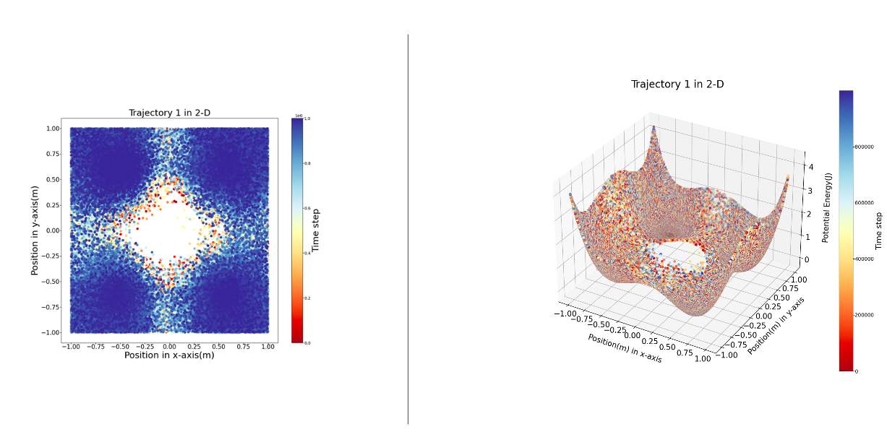
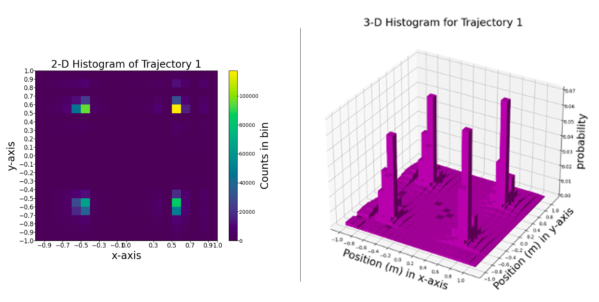
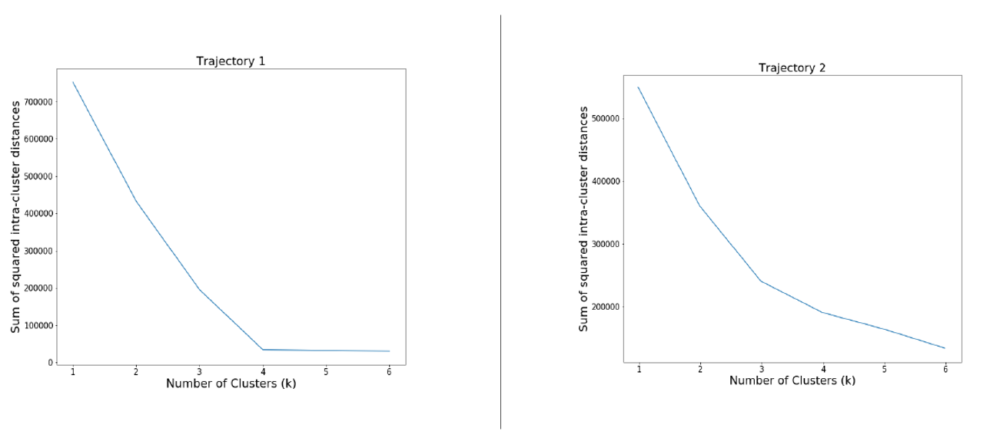
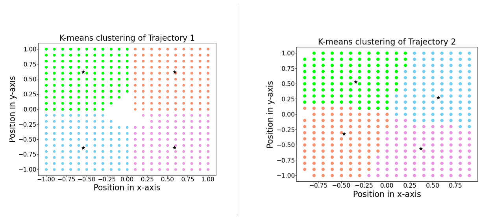

# Introduction and Objective:
In this work, we will analyse two saparate molecular simulation trajectories generated by two saparate methods. One of
the trajectories has been computed by a molecular dynamics simulation, the other by Metropolis Hasting Monte-Carlo method.
But we do not know beforehand which is generated by which method.  We will explore each of trajectory  and potential in a detailed manner looking into 2-D and 3-D plots and making Histograms. 
 
We will also implement elbow method to find out optimal clusters for the partitioning method.
We will use k-mean clustering as a partitioning method. **Please refer the analysis.pdf for analytical inferences and .ipynb for code.** 

## About the Dataset
The dataset contains two trajectory files. two trajectories of a particle (mass =1 kg) in a two-dimensional potential (traj1.txt and traj2.txt). The Trajectories contain position coordinates (in m) and the potential energy at that position (in J). One of
the trajectories has been computed by a molecular dynamics simulation, the other by Metropolis Hastings
Monte-Carlo. Both trajectories have 1000000 time steps. Each contains the following format where x, y is position and E is corresponding potential energy of molecule at that position.
|x|y|E|
|---|---|---|

## Analysis summary:

### Visualization of trajectories with potential energies

### Histogram of Trajectories

## Elbow Method with K-means Clustering:
Before clustering, elbow method is also used to find out optimal number of clusters. The basic idea behind partitioning methods, such as k-means clustering, is to define clusters such that the total intra-cluster variation (or total within-cluster sum
of square (WSS)) is minimized and we want it to be as small as possible. We compute clustering algorithm (e.g., k-means clustering) for different values of k (1 to 10). Figure shows results for rajectory 1. 

### Elbow Method:
The Elbow Method can be de ned as follow:
- For each k, calculate the total of within-cluster sum of square (wss).
- Plot the curve of wss according to the number of clusters k.
- The location of a bend (knee) in the plot is generally considered as an indicator of the appropriate number of clusters.

For First trajectory, elbow method shows 4 clusters clearly, while for second trajectory it is not very much
clear.

### K-means Clustering :
- Randomly choose cluster centers.
- Assign points to closest center.
- Update centers.
- Reassign the points to cluster centers.
- Repeat until the convergence reached. The convergence means when the membership no longer changes
or changes less than the tolerance limit.

