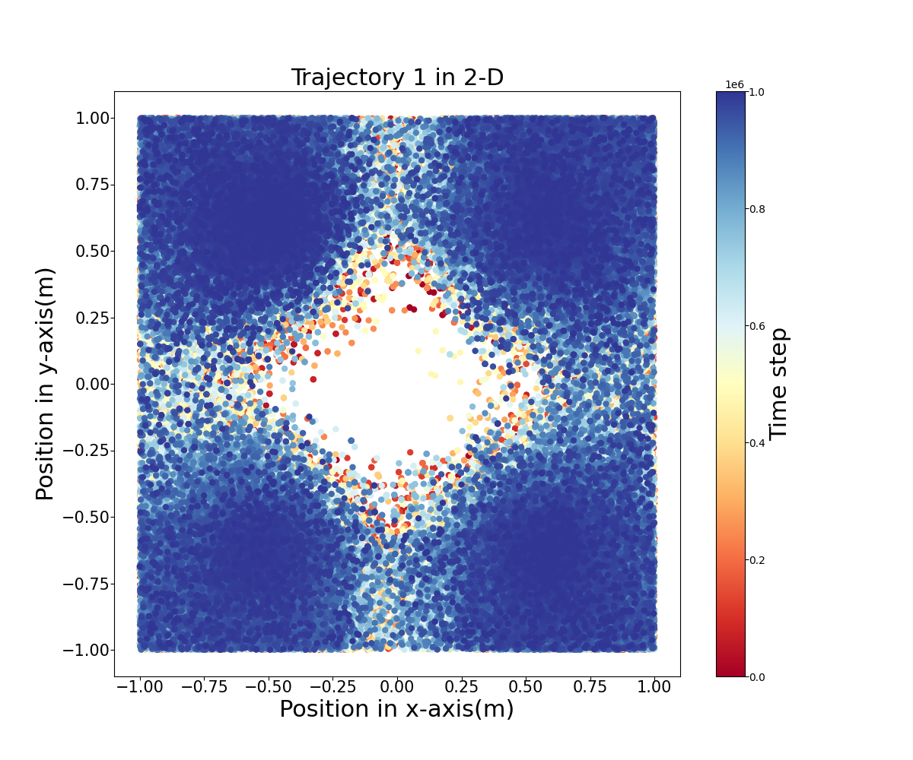
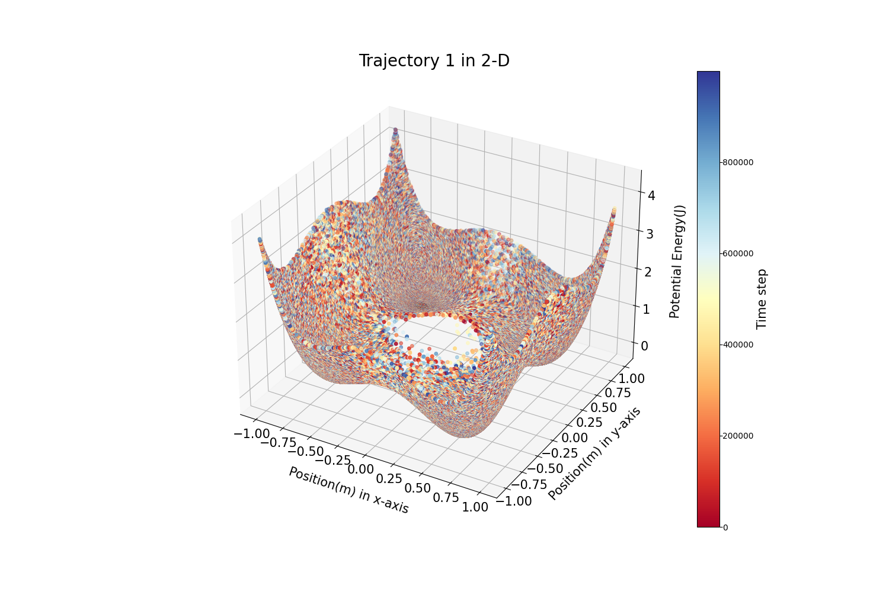
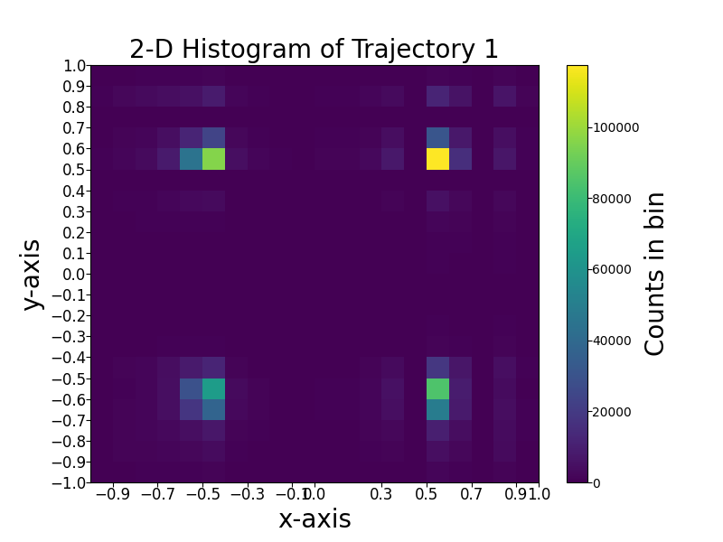
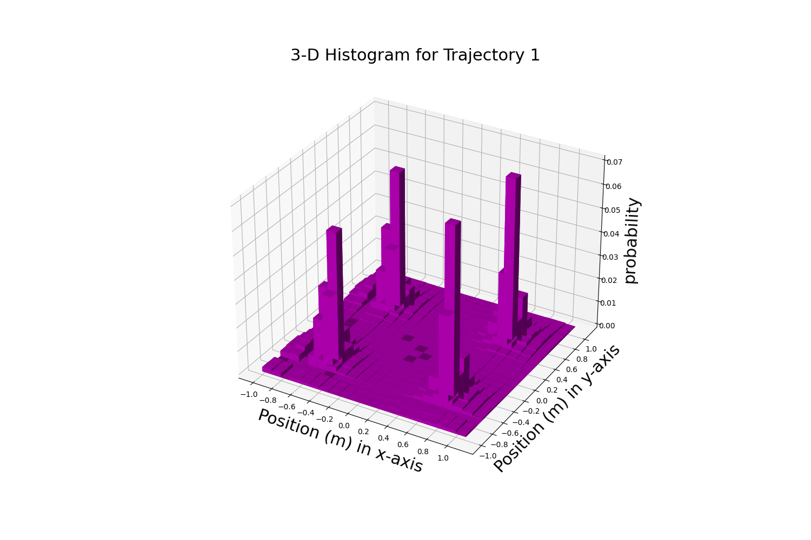
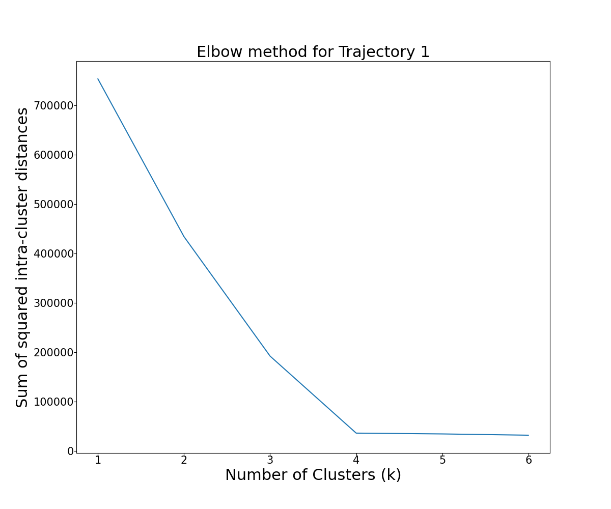
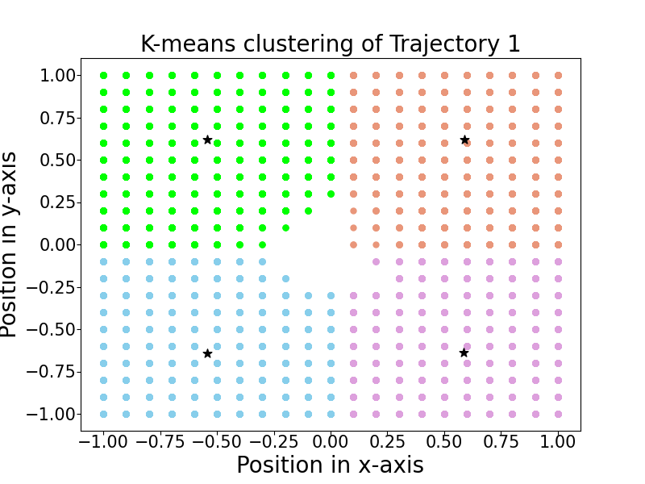

# Introduction and Objective:
In this work, we will analyse two saparate molecular simulation trajectories generated by two saparate methods. One of
the trajectories has been computed by a molecular dynamics simulation, the other by Metropolis Hasting Monte-Carlo method.
But we do not know beforehand which is generated by which method.  We will explore each of trajectory  and potential in a detailed manner looking into 2-D and 3-D plots and making Histograms. 
 
We will also implement elbow method to find out optimal clusters for the partitioning method.
We will use k-mean clustering as a partitioning method. **Please refer the analysis.pdf for analytical inferences and .ipynb for code.** 

## About the Dataset
The dataset contains two trajectory files. two trajectories of a particle (mass =1 kg) in a two-dimensional potential (traj1.txt and traj2.txt). The Trajectories contain position coordinates (in m) and the potential energy at that position (in J). One of
the trajectories has been computed by a molecular dynamics simulation, the other by Metropolis Hastings
Monte-Carlo. Both trajectories have 1000000 time steps. Each contains the following format where x, y is position and E is corresponding potential energy of molecule at that position.
|x|y|E|
|---|---|---|

## Analysis summary:

### Visualization of trajectories

### Visualization of Potential Energy

### Histogram of Trajectories

## k-mean Clustering for trajectory 1
#### Elbow Method:

